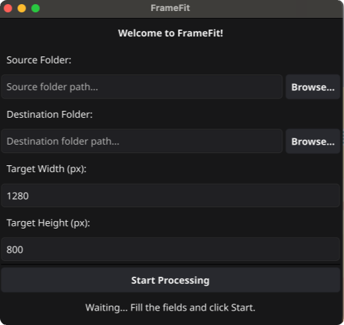

# 🖼️ FrameFit

FrameFit is a smart, automated batch image resizing tool designed to perfectly crop and fit your photos into a specific target resolution. It uses AI face detection and smart cropping to ensure the most important subjects (like people) are always kept in the frame, while applying a professional cinematic background blur to vertical/portrait photos.



## ✨ Features

* **🧠 Smart Face Detection:** Uses the [pigo](https://github.com/esimov/pigo) cascade classifier to detect faces and perfectly center them within the new frame.
* **🎯 Smart Cropping:** Fallback to [smartcrop](https://github.com/muesli/smartcrop) for images without faces to automatically find the most interesting part of the picture.
* **🎬 Cinematic Blur:** Automatically detects portrait (vertical) images and applies a beautiful, feathered cinematic background blur to fit landscape dimensions seamlessly.
* **🖥️ Modern GUI:** Easy-to-use graphical interface powered by [Fyne](https://fyne.io/), complete with native OS folder selection dialogs via [Zenity](https://github.com/ncruces/zenity).
* **📦 Standalone Executable:** The AI model is securely embedded directly into the app. No extra files or installations required for the end user!
* **🌍 Cross-Platform:** Available and pre-compiled for Windows, macOS, and Linux.

---

## 🚀 Download and Usage (For Standard Users)

You don't need to be a developer or install any programming tools to use FrameFit!

1. Go to the [Releases page](../../releases/latest) of this repository.
2. Download the correct file for your operating system:
   * **Windows:** Download the `FrameFit-Windows.zip` file (extract it and run the `FrameFit.exe` inside).
     * 🪟 **Note for Windows users:** If you see a blue "Windows protected your PC" screen, it is a standard security warning for independent/unsigned apps. Just click **More info** and then **Run anyway**.
   * **macOS:** Download the `FrameFit-Mac.zip` file (extract it to get the `FrameFit.app` application).
     * 🍏 **Note for macOS users:** If your Mac says the app is "damaged and can't be opened" or silently fails to launch, it's a false alarm caused by macOS Gatekeeper for independent apps. To unlock it, move `FrameFit.app` to your **Applications** folder, open the **Terminal**, and run these two commands:
       ```bash
       xattr -cr /Applications/FrameFit.app
       codesign --force --deep --sign - /Applications/FrameFit.app
       ```
       The first command removes the quarantine, and the second restores the local signature. You can now open the app normally via Finder!
   * **Linux:** Download the `FrameFit-Linux.zip` file (extract it and run the executable inside).
     * 🐧 **Note for Linux users:** You may need to grant execution permissions before running the app. Open your terminal in the extracted folder and run `chmod +x FrameFit`, or right-click the file, go to Properties, and check "Allow executing file as program".
3. Launch the application.
4. Click **Browse...** to select your **Source Folder** (containing your original `.jpg` or `.png` images).
5. Click **Browse...** to select a **Destination Folder** (where the resized images will be saved).
6. Set your target **Width** and **Height** in pixels.
7. Click **Start Processing** and let the magic happen!

---

## 🛠️ Building from Source (For Developers)

If you want to modify the code or build the application yourself, follow these steps:

### Prerequisites
* [Go](https://golang.org/doc/install) 1.26 or higher.
* A C compiler (e.g., `gcc`) installed on your system (required by Fyne's graphical components).

### Setup & Run
1. Clone the repository and navigate to the source folder:
   ```bash
   git clone [https://github.com/danielebelfiore/frame-fit.git](https://github.com/danielebelfiore/frame-fit.git)
   cd frame-fit/src
   ```
2. Download dependencies:
   ```bash
   go mod tidy
   ```
3. Run the application during development:
   ```bash
   go run main.go
   ```
   *(Note for macOS users: You might see a `-lobjc` duplicate warning in the terminal. You can safely ignore it, or suppress it by running `CGO_LDFLAGS="-Wl,-w" go run main.go`)*.

### Generating the App Executable
To package the app into a final standalone file with its icon:
   ```bash
   go run fyne.io/tools/cmd/fyne@latest package -name FrameFit -icon icon.png
   ```

---

## ⚙️ Automated Builds (CI/CD)

This project uses **GitHub Actions** for Continuous Deployment. 
Every time a new version tag (e.g., `v1.0.0`) is pushed to the repository, the pipeline automatically:
1. Compiles the Go code for Windows, macOS, and Linux.
2. Packages the executables into clean `.zip` archives for easy and safe distribution.
3. Creates a new public **Release** and attaches all the ready-to-use `.zip` files automatically.